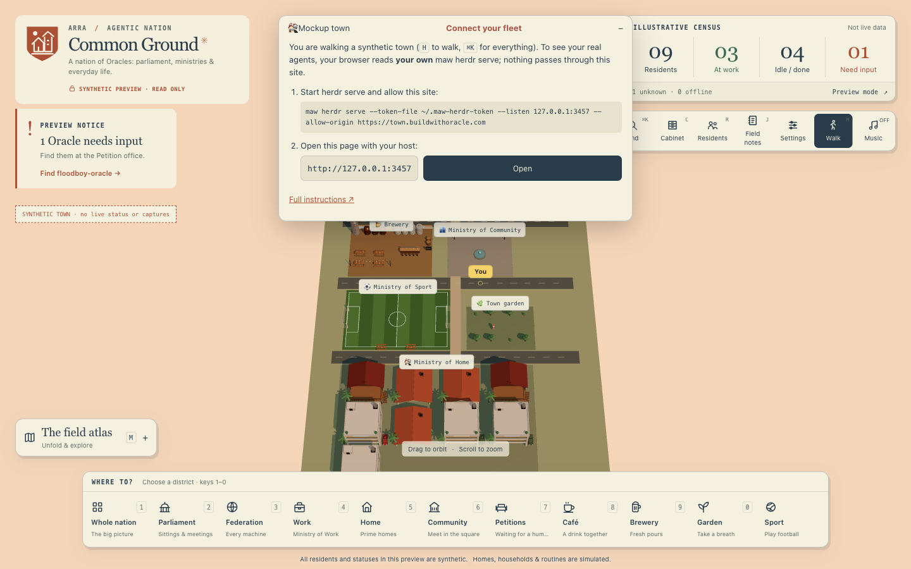
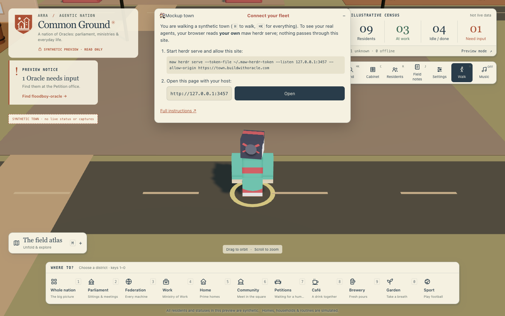
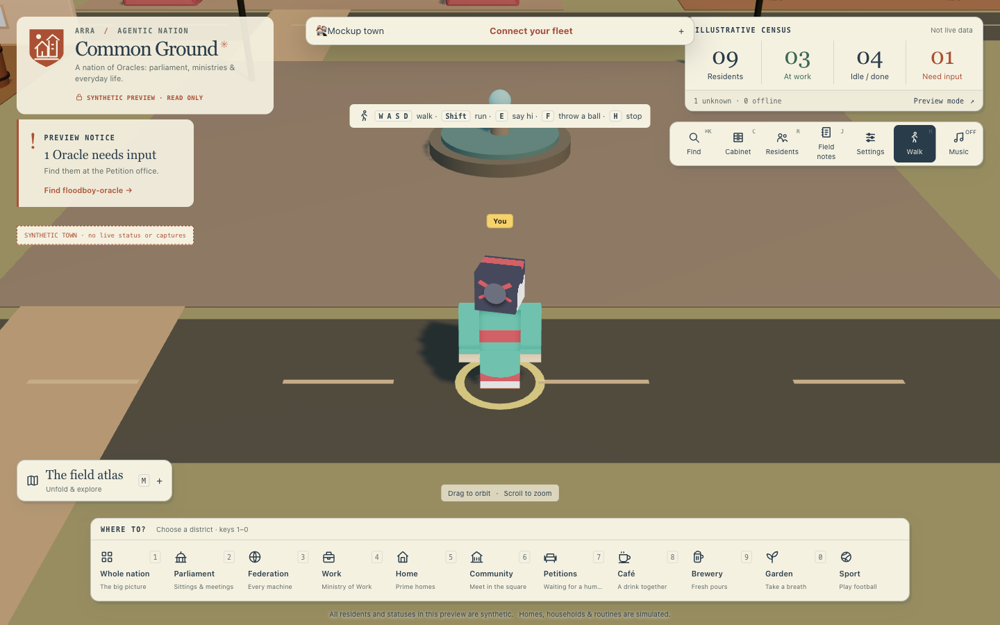
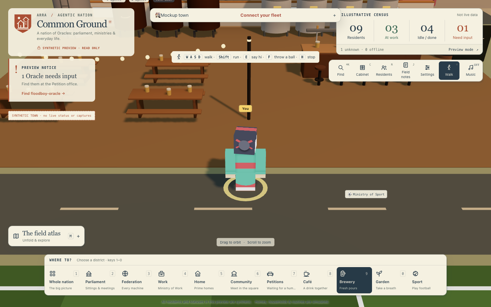
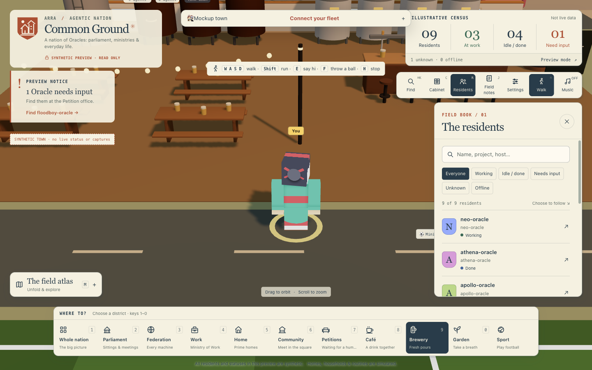
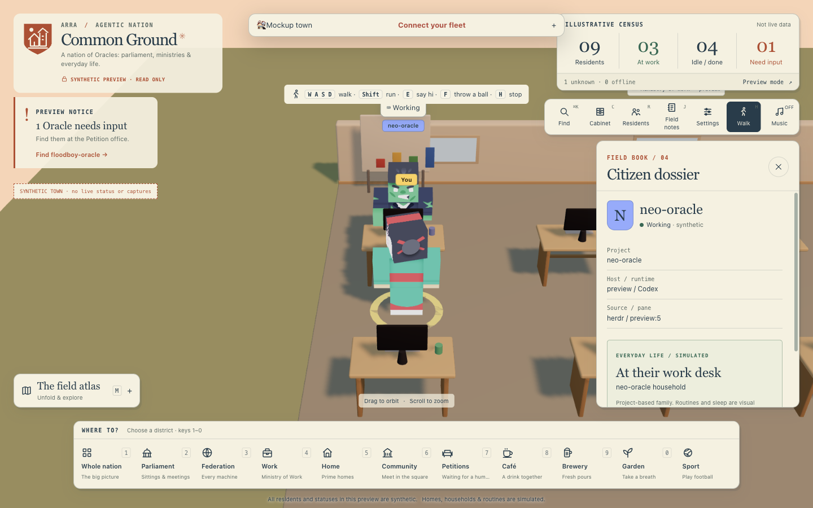
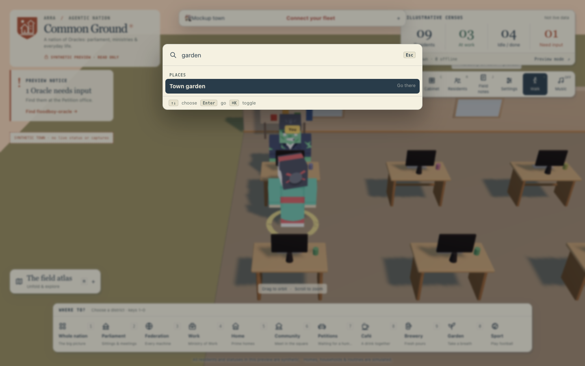
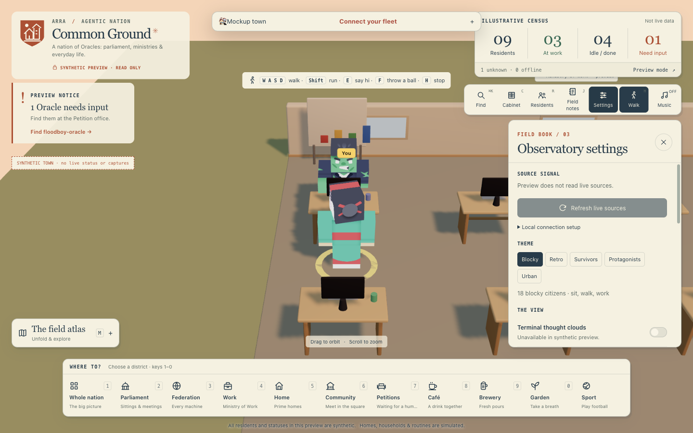
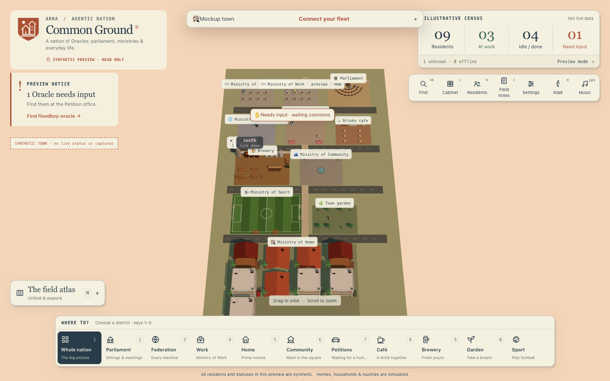

# Walk the town: a first tour of Common Ground

Common Ground draws an agent fleet as a small 3D nation. Real status comes from your own
`maw herdr serve`; homes, routines and everything else around it are simulated and labelled as such.

This tour uses the hosted site, **https://town.buildwithoracle.com**, with no server connected, so every
resident you see is synthetic. Step 8 connects your own fleet.

All screenshots were taken on 2026-10-06 at 1440 × 900.

## 1. Arrive in the god view

Open https://town.buildwithoracle.com. You arrive above the whole town: work campuses at the back, then the
brewery and the Ministry of Community, the football pitch and the garden, and the homes at the front.

Because no server is connected, a **Connect your fleet** card is open at the top and the badge under the
title says **SYNTHETIC PREVIEW · READ ONLY**.



## 2. Fly down and walk

After about three seconds the camera flies down to your citizen, marked **You**, standing on the road. The
address bar gains `?walk=1`, so a reload keeps you walking.



Close the card with **−** in its corner to see more of the town; **+** opens it again.

| Key | Does |
|---|---|
| `W` `A` `S` `D` | walk |
| `Shift` | run |
| click the ground | walk there (`Shift`-click runs) |
| `E` | say hi to whoever is closest |
| `F` | throw a ball |
| `H` | stop walking and go back to the god view |
| drag / scroll | orbit / zoom; the camera keeps your zoom while you walk |



## 3. Travel to a district

The **Where to?** bar at the bottom lists every district; keys `1`–`0` pick one. While walking, picking a
district takes you to its entrance. Here **Brewery** (key `9`) put us on the road in front of the beer hall.



## 4. Find a resident

Open **Residents** (key `R`) in the toolbar at the top right. Search by name, project or host, or filter by
status: Working, Idle / done, Needs input, Unknown, Offline.



## 5. Go to a resident

Click a resident. If they are close you walk to them; if they are far you are moved next to them. The
**Citizen dossier** opens on the right with their project, host and runtime, and the address bar becomes
`/s/<their id>`, a link you can share.



With a fleet connected, a thought cloud above a working resident shows their terminal. Click it to open
that terminal full screen.

## 6. Search everything with ⌘K

Press `⌘K` (or **Find**) to search places, residents and actions in one list. `↑` `↓` choose, `Enter` goes.



## 7. Settings

**Settings** holds the source status, the character theme (Blocky, Retro, Survivors, Protagonists, Urban),
terminal thought clouds, sound, the work tour and the ball toggle.



## 8. Stop walking, and connect your own fleet

Press `H` to stop walking. The camera returns to the whole nation and **Whole nation** is selected in the
bar. Parliament, every ministry and the petition office (for agents waiting on a human) are visible.



To see your real agents, follow the **Connect your fleet** card from step 2. Your browser talks to your
own server directly; nothing passes through town.buildwithoracle.com:

1. Start herdr serve and allow the site:

   ```sh
   maw herdr serve --token-file ~/.maw-herdr-token --listen 127.0.0.1:3457 \
     --allow-origin https://town.buildwithoracle.com
   ```

2. Enter your host in the card, for example `http://127.0.0.1:3457`, and press **Open**. The page reloads
   as `https://town.buildwithoracle.com/?host=http://127.0.0.1:3457`.
3. Paste your token when asked. It is kept for this browser tab only (sessionStorage). With a token, the
   full-screen terminal accepts typing; without one, the town is read-only.

An allowed origin can read every pane that server sees. Only allow sites you trust.

To run the whole thing locally instead, see [Run](../../README.md#run) in the main README.
